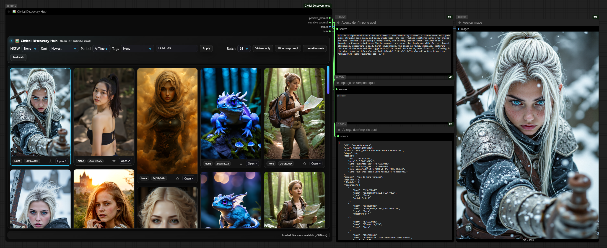

# 📜 ComfyUI-Civitai-Discovery-Hub

[☕ Support on Ko-fi](https://ko-fi.com/light_x02)

> Browse the **Civitai** gallery directly inside **ComfyUI**: enjoy infinite scrolling, advanced filters (including **NSFW**), favorites management, **videos only** mode, and direct integration of prompts, metadata, and images/videos into your workflows.

- **GitHub**: [https://github.com/Light-x02/ComfyUI-Civitai-Discovery-Hub](https://github.com/Light-x02/ComfyUI-Civitai-Discovery-Hub)
- **Node name in ComfyUI**: **Civitai Discovery Hub**



---

## ✨ Main Features

- **Infinite scrolling**: automatically loads more items when reaching the bottom, with no limit.
- **Advanced filters**: NSFW, sort (Newest / Most Reactions / Most Comments), period (Day / Week / Month / Year / AllTime), tags, user.
- **“Videos only” mode**: display only videos.
- **"Hide no-prompt"**: exclude content without positive prompts.
- **Favorites**: add/remove favorites (★) and switch to **Favorites only** view.
- **Workflow outputs**: positive/negative prompts, JSON metadata, selected image/video.
- **Modern UI**: adaptive masonry grid, polished design, real-time loading status.

---

## 🧩 Installation

### Method 1: Install via ComfyUI Manager

2. Go to the **Custom Nodes** section in the interface.
3. Search for **"ComfyUI-Civitai-Discovery-Hub"** and install it directly from the ComfyUI Manager.
4. **Restart ComfyUI**  
   Restart ComfyUI to load the node.

### Method 2: Clone the Repository
1. Open a terminal or command prompt.
2. Run the following command to clone the repository:
   ```bash
   git clone https://github.com/Light-x02/ComfyUI-Civitai-Discovery-Hub.git
   ```
3. **Restart ComfyUI**  
   Once the files are in place, restart ComfyUI to load the node.

---

## 🚀 Usage in a workflow

Node outputs:

- **Positive Prompt** *(STRING)*
- **Negative Prompt** *(STRING)*
- **Image** *(IMAGE tensor, downloaded if a connection is active)*
- **Info** *(STRING, formatted JSON metadata)*

💡 **Tip**: Connect the **Image** output only if you want the preview to be downloaded as a tensor. This saves resources when you don’t need it.

---

## 🖱️ Interface & Controls

### Control Bar

- **NSFW**: `None | Soft | Mature | X`
- **Sort**: `Newest | Most Reactions | Most Comments`
- **Period**: `AllTime | Year | Month | Week | Day`
- **Tags**: list of organized tags
- **Username**: filter by user
- **Apply**: apply filters
- **Batch**: `24 | 50 | 100 | 150` (batch size)
- **Videos only**: display only videos
- **Hide no-prompt**: hide content without prompts
- **Favorites only**: show only favorites
- **Refresh**: reload results

### Grid & Cards

- **★ Favorite**: toggle favorite with one click
- **Open ↗**: open the Civitai page in the browser

### Selection

Click on a card to select:

- **Prompts** (positive/negative)
- **Info JSON**
- **Image/Video** tensor (if output is connected)

---

## 💡 Performance Tips

- **Batch 50–100**: good balance between speed and memory.
- **Videos only**: the first batch is optimized for quick previews.
- **Hide no-prompt**: useful to focus on workflow-ready content.
- **Favorites**: use **Favorites only** mode to build reusable libraries.

---

## ❓ FAQ

**Q. I scroll to the bottom and nothing loads, what should I do?**\
Stay at the bottom: the “near-bottom” mechanism automatically triggers loading. If the network is slow, wait until the current batch finishes (check the status). If it still seems stuck, scroll slightly up and back down to re-trigger.

**Q. Favorites don’t appear immediately in “Favorites only” mode.**\
The list is refreshed automatically, but if there is still a delay, use **Refresh** to sync.

**Q. Why do some videos take time to show a preview?**\
Videos load metadata first. The preview appears after a micro-seek. On slow networks, a fallback forces full loading.

---

## 🔗 Useful Links

- **Repo GitHub** : [ComfyUI-Civitai-Discovery-Hub](https://github.com/Light-x02/ComfyUI-Civitai-Discovery-Hub)
- **Ko-fi** : [https://ko-fi.com/light\_x02](https://ko-fi.com/light_x02)

---

## 🙏 Acknowledgements

Thanks to the ComfyUI community for feedback and suggestions.\
A coffee always helps inspire new [features](https://ko-fi.com/light_x02)[ 👉 ](https://ko-fi.com/light_x02)[Ko-fi](https://ko-fi.com/light_x02).

